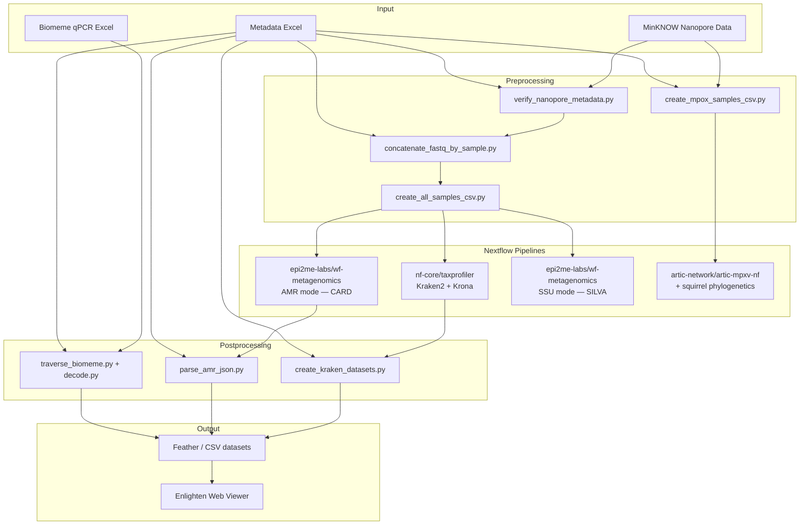

# pipeline_scripts

## Overview

Utilities and scripts for the **ODIN** taxonomic profiling pipeline and related analysis workflows. The toolset covers Kraken2 classification, antimicrobial resistance (AMR) detection, Mpox consensus/phylogenetic analysis, and Biomeme qPCR processing. Targets WSL Ubuntu 24.04 with Docker and Nextflow; Python scripts run cross-platform.

## Pipeline Workflows

The ODIN system provides four main analysis pipelines plus a visualization layer:

| Pipeline | Script | Engine | Purpose |
|----------|--------|--------|---------|
| **Taxprofiler** | `start_nextflow.sh` | nf-core/taxprofiler | Kraken2 taxonomic classification + Krona visualization |
| **AMR** | `start_nextflow_amr.sh` | epi2me-labs/wf-metagenomics | Antimicrobial resistance gene detection (CARD database) |
| **SSU** | `start_nextflow_ssu.sh` | epi2me-labs/wf-metagenomics | 16S/18S rRNA analysis (SILVA database) |
| **Mpox** | `start_mpox.sh` | artic-network/artic-mpxv-nf + squirrel | Mpox consensus calling + phylogenetics |
| **Biomeme** | `start_biomeme.sh` | Python (decode.py) | qPCR Cq extraction, abundance calculation, quality flagging |

Results from all pipelines feed into **Enlighten**, a Docker-based web visualization platform (`start_enlighten.sh`).



## Architecture

| Layer | Component | Purpose |
|-------|-----------|---------|
| Core library | `scripts/nanopore_metadata.py` | DataFrame utilities, metadata reading, run accession management |
| Data parsers | `scripts/kraken_parser.py`, `scripts/parse_amr_json.py` | Parse Kraken2 reports, AMR JSON outputs |
| Dataset builders | `scripts/create_kraken_datasets.py` | Merge Kraken2 reports with metadata, produce Feather/CSV outputs |
| qPCR processing | `scripts/decode.py`, `scripts/traverse_biomeme.py` | Extract Cq values, calculate abundance, quality flagging |
| FASTQ management | `scripts/concatenate_fastq_by_sample.py` | Concatenate reads across runs per sample |
| Pipeline orchestrators | `scripts/start_nextflow*.sh`, `scripts/start_mpox.sh`, `scripts/start_biomeme.sh` | Invoke Nextflow pipelines + Python utilities |
| Visualization | `scripts/start_enlighten.sh`, `enlighten/` | Docker Compose for Enlighten web viewer |
| Config utilities | `scripts/config_utils.sh` | Sourced by all bash scripts: path resolution, venv setup, interactive prompts |
| Validation | `scripts/verify_nanopore_metadata.py`, `scripts/integrity_check.py` | Metadata verification, system integrity checks |

## Configuration

- **Path resolution**: `config_utils.sh` reads `~/.odin_ml/odin_paths.txt` (user override) → `scripts/odin_paths.txt` (default). Always source `config_utils.sh` at the top of new bash scripts.
- **Nextflow profiles**: `odin` (4 CPU / 16 GB / 1 h) and `odin_big` (16 CPU / 31 GB / 3 h) — both Docker-only, local executor. Config: `config/odin.config`.
- **Assay parameters**: `config/assay-params.csv` — qPCR reference data (slope, intercept, efficiency, threshold per pathogen).
- **Databases**: `input_sheets/databases.csv` — Kraken2 database paths for taxprofiler.

## Build and Test

```bash
# Install dependencies (activate venv first)
pip install -r requirements.txt

# Run all tests
python run_tests.py

# Run by marker (unit / integration / slow)
./tests/run_tests.sh unit
./tests/run_tests.sh integration coverage   # + HTML coverage at htmlcov/

# PowerShell (Windows)
./tests/run_tests.ps1 -TestType unit -Coverage
```

Test config: `pytest.ini` — discovers `tests/test_*.py`, markers: `unit`, `integration`, `slow`.

## Data Conventions

- **Feather** (`.feather`, Apache Arrow) is preferred over CSV for large datasets — always save both formats when producing pipeline outputs.
- **Metadata workbook** (`.xlsx`): `nanopore` sheet + `sites` sheet. Header on row 2; row 3 always skipped (`skiprows=[2]`); data starts row 4.
- **Kraken2 reports**: 6-column TSV (`.kreport.txt`). Rank codes: `U`, `R`, `D`, `K`, `P`, `C`, `O`, `F`, `G`, `S`.
- **AMR JSON structure**: `{barcode → {pass, results → {gene_description → {count, meta: [{RESISTANCE, SEQUENCE, START, END, %COVERAGE, %IDENTITY}]}}}}`.

## Documentation

### Setup
- [Mobile Lab Computer Setup Guide](./doc/setup_mobile_lab_computer.md) — WSL, Docker, Java, Nextflow installation
- [Artic & Squirrel Setup](./doc/setup_artic_squirrel.md) — Conda environments for Mpox analysis

### Pipeline Usage
- [Running Scripts Guide](./doc/run_scripts_guide.md) — How to use the pipeline scripts
- [Taxprofiler Pipeline](./doc/start_nextflow.md) — `start_nextflow.sh` usage
- [AMR Detection Pipeline](./doc/start_nextflow_amr.md) — `start_nextflow_amr.sh` usage
- [SSU rRNA Pipeline](./doc/start_nextflow_ssu.md) — `start_nextflow_ssu.sh` usage
- [Mpox Pipeline](./doc/start_mpox.md) — `start_mpox.sh` usage
- [Biomeme qPCR Pipeline](./doc/start_biomeme.md) — `start_biomeme.sh` usage
- [Enlighten Visualization](./doc/start_enlighten.md) — Starting the web viewer

### Reference
- [Bash Scripts Reference](./doc/bash_scripts_reference.md) — All scripts, arguments, and behavior
- [AMR Parser Details](./doc/README_AMR_PARSER.md) — AMR JSON parsing
- [FASTQ Concatenation](./doc/README_CONCATENATE_FASTQ.md) — FASTQ merging workflow
- [Biomeme Processing](./doc/biomeme_processing.md) — qPCR quality flagging logic
- [Troubleshooting Guide](./doc/troubleshooting.md) — Common issues and solutions
- [Release Notes](./doc/releases.md)


