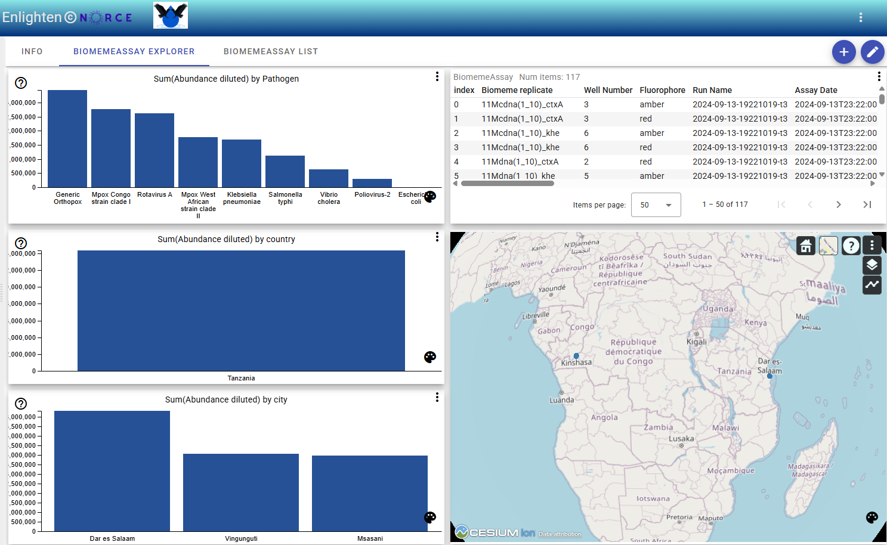

# BiomemeAssay Explorer Template: Using Enlighten for Interactive Bar Chart Selections

To use the enlighten feature for making selections in bar charts (Pathogen, City, Country) and view abundance at different levels:

1. **Open the Dataset Explorer**  
Select a dataset that matches the template (e\.g\., using the `open_in_new` icon)\.

2. **Locate the Bar Charts**  
Find the bar charts labeled by Pathogen, City, or Country in the explorer view\.

3. **Use Enlighten for Selection**  
Click on a bar in any chart to activate enlighten\. This will highlight your selection and update related charts and tables to show abundance data filtered by your choice\.

4. **Compare Levels**  
Switch between Pathogen, City, and Country charts to view abundance at different aggregation levels\. Each selection refines the displayed data accordingly\.

**Notes:**  
\- Enlighten enables interactive exploration and comparison across different categories\.  
\- Selections are reflected in all linked visualizations and tables\.  
\- To reset, deselect the highlighted bar or in the overflow menu choose "Clear all filters"\.

---

## Downloading Your Selection as a CSV File

After making a selection in the bar charts, you can download the filtered data as a CSV file:

1. **Go to the Table View**  
   Switch to the table view where your filtered selection is displayed.

2. **Open the Drop Down Menu**  
   Click the drop down menu (often shown as three dots or an arrow) above the table.

3. **Select "Download table (csv format)"**  
   Choose the "Download table (csv format)" option to export the currently filtered data.

This allows you to save and share your selected subset for further analysis or reporting.
