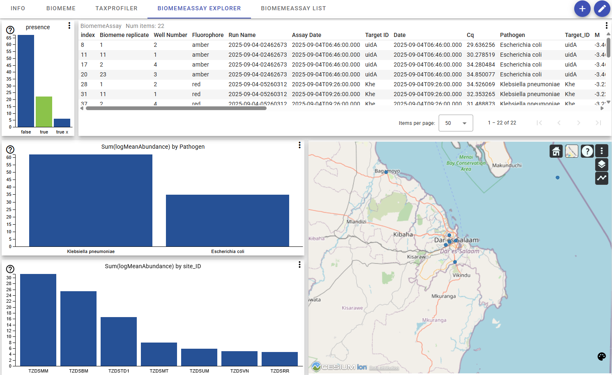

# Release Notes

## 2025-09-11

### Pipeline Scripts & Documentation Update

- **Documentation:** Added a well-formatted advisory note about "Stale drvfs state in WSL" to the documentation, including troubleshooting for `mkdir -p` errors. The Table of Contents now clearly indexes this as "Error with mkdir: Stale drvfs State in WSL" for easier discovery.
- **Logging Improvements:**
    - INFO and WARNING messages now use colored output (bright yellow for INFO, red for WARNING) for better visibility in terminal scripts.
    - Print statements and logging in sample sheet generation scripts have been updated for consistency and clarity.
    - Barcode reporting improved: valid and skipped barcodes are now listed in output messages.
- **Data Processing Fixes:**
    - Corrected mean abundance calculation in decode.py: now groups by Biomeme_sample_ID, Target ID, Run Name, and Fluorophore for improved accuracy.
    - Ensured numeric value for fastq_count in sample sheet generation.
    - Improved handling and reporting for barcode directories and skipped files.
- **Miscellaneous:**
    - xlsx_data_path is now stored for reference in relevant scripts.

#### How to Update

Run the following command in your `pipeline_scripts` folder to get the latest release:

```sh
git pull
```

#### Advisory: Stale drvfs State in WSL

> **Note:**
> Occasionally, scripts may fail with an error from `mkdir -p` such as:
> ```
> mkdir: cannot create directory '...': File exists
> ```
> This is often caused by a **stale drvfs state** in Windows Subsystem for Linux (WSL), where the filesystem view becomes out of sync with Windows.
> **Solution:**
> To resolve this, reset WSL by running:
> ```bash
> wsl --shutdown
> ```
> Then restart your WSL session and rerun the script. This will refresh the filesystem state and prevent such errors.

## 2025-09-10

### Biomeme Pipeline & Viewer Update

- The biomeme pipeline now generates a new column, `logMeanAbundance`, which provides a log-transformed version of the mean abundance for each measurement.
- The `logMeanAbundance` column has also been added as the y-axis in the Pathogen and site_ID bar charts within the biomeme viewer template, enabling improved visualization and interpretation.
- The Docker configuration for Enlighten has been updated to use the latest version: `norceresearch1/basic-enlweb:odin1.0.3`. This ensures you have access to the newest features and improvements in the viewer environment, with a smoother and more reliable experience.
- The calculation of `Mean Abundance` in the biomeme pipeline has been corrected. It is now computed as the mean of all abundance values within each Biomeme_sample_ID group, also grouped by Target ID, Run Name, and Fluorophore. This ensures more accurate and representative values for downstream analysis and visualization.

#### How to Update

To obtain the latest release, run the following command in your `pipeline_scripts` folder:

```sh
git pull
```

This will update both the biomeme pipeline and the biomeme_viewer template.

#### Important Note

After updating, it is essential to run or re-run the biomeme pipeline using:

```sh
./start_biomeme.sh
```

This ensures that the new `logMeanAbundance` and corrected `Mean Abundance` columns are generated in your dataset before using the updated view template. The new viewer template relies on these columns for proper functionality.



## 2025-09-09

### Biomeme Pipeline & Viewer Improvements

- Refined the logic for the `presence` column in the biomeme pipeline to ensure:
    - `true` is set only if `quality_flag` is 1 and mean abundance is greater than 0.
    - `true_x` is set if `quality_flag` is 2 and mean abundance is greater than 0.
    - `false` is set for all other cases.
    - No presence flag is set for rows where the Biomeme replicate contains "NTC".
- The `quality_flag` is determined for each measurement as:

    | Flag Value | Meaning                                                                                 |
    |------------|----------------------------------------------------------------------------------------|
    | 0          | Not checked (default, before flagging logic is applied)                                |
    | 1          | **Good**: More than one non-zero Cq value for the replicate/target combination         |
    | 2          | **Questionable**: Only one non-zero Cq value for the replicate/target combination      |
    | 3          | **Bad**: Cq value is zero (no amplification detected)                                  |
    | 4          | **Below NTC threshold**: Cq value is below the NTC (No Template Control) threshold for matching fluorophore and target ID |

- The biomeme viewer template now includes a corresponding bar chart tile for selecting pathogens where presence is detected, allowing users to easily filter and visualize samples with confirmed detections.
- Updated the biomeme viewer template to use the new logic for the `presence` column, improving the accuracy of pathogen detection and filtering.
- Improved documentation for the biomeme pipeline and viewer, including a detailed explanation of the presence column and quality flag criteria.
- For the image `norceresearch1/basic-enlweb:odin1.0.3`, several improvements were made to the bar chart component:
    - Added a check for null values in the y-axis, to prevent issues when Mean Abundance is zero (this should ideally be fixed server-side, but is now also handled in the bar chart).
    - Added a check to detect changes in the data, so that margins are updated when the data changes.
    - Improved the color legend in the bar chart for better clarity and usability.
