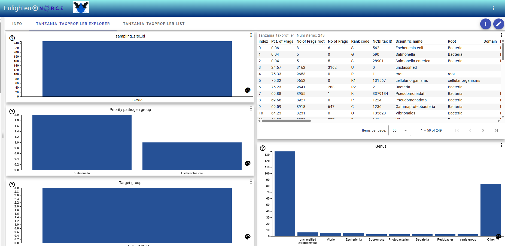
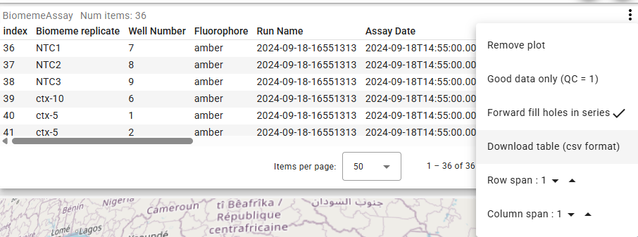

# Taxprofiler Explorer Template: Interactive Bar Chart Selections

To use the template feature for datasets with the taxprofiler template in the front end:

1. **Locate Your Dataset**  
In the table view, find the dataset whose name matches the template regex configured in `ServerConfig.json`.

2. **Find the Template Icon**  
Next to the matching dataset, look for the template icon:  
`<mat-icon>open_in_new</mat-icon>`

3. **Click the Icon**  
Click the `open_in_new` icon to open the taxprofiler template for that dataset.

4. **Explore Bar Charts**  
In the explorer view, use the interactive bar charts for **sampling site**, **Priority pathogen group**, **Genus**, and **Target group** to make selections.

5. **View Abundance Data**  
Select bars to filter and view abundance data at different levels. The display updates according to your selection.

**Notes:**  
\- The `open_in_new` icon only appears for datasets matching the configured regex.  
\- The taxprofiler template enables interactive exploration by category.  
\- Selections are reflected in all linked visualizations and tables.  
\- If you do not see the icon, check your server configuration and refresh the page.

---

## Downloading Your Selection as a CSV File

After making a selection in the bar charts, you can download the filtered data as a CSV file:

1. **Go to the Table View**  
   Switch to the table view where your filtered selection is displayed.

2. **Open the Drop Down Menu**  
   Click the drop down menu (often shown as three dots or an arrow) above the table.

3. **Select "Download table (csv format)"**  
   Choose the "Download table (csv format)" option to export the currently filtered data.

This allows you to save and share your selected subset for further analysis or reporting.
